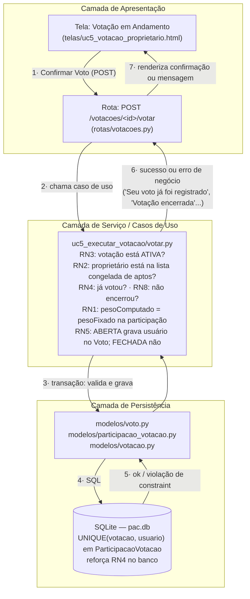
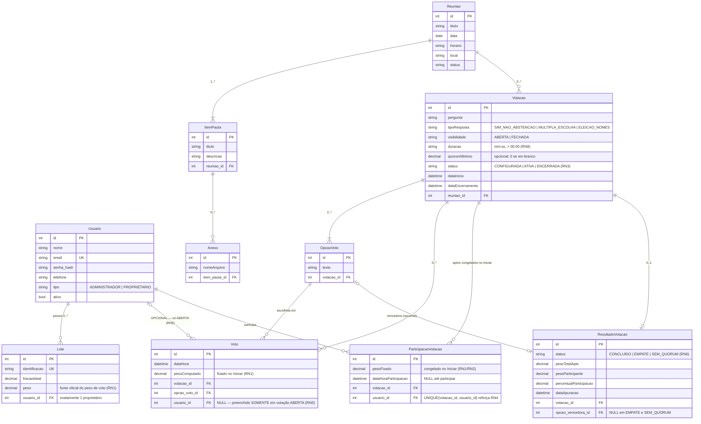
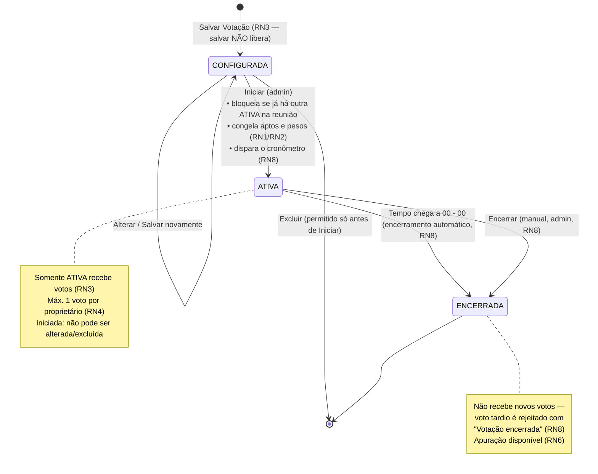

# Documento de Arquitetura — PAC (Plataforma de Assembleias Condominiais)

**Versão:** 1.0 · **Base:** ERSw PAC 1.1 (Equipe APEX, 01/07/2026) · **Recorte:** UC1, UC4, UC5 e UC6

---

## 1. Visão geral

O **PAC — Plataforma de Assembleias Condominiais** é um sistema web *mobile-first* para
gestão de assembleias e votações de condomínio, especificado na ERSw versão 1.1. Existem
dois perfis de usuário: o **Administrador/Síndico**, que configura, inicia e encerra
votações e consulta resultados; e o **Proprietário**, vinculado a zero ou vários lotes,
que vota e consulta resultados.

Este projeto implementa **exatamente quatro funcionalidades**, rastreáveis à ERSw:

| # | Funcionalidade | Caso de uso | Requisitos | Regras de negócio |
|---|----------------|-------------|------------|-------------------|
| 1 | Entrar no sistema | UC1 — Autenticação de Usuários | RF9, RNF4 | — |
| 2 | Criar votação | UC4 — Configuração de Votações | RF5 | RN3, RN7, RN8, RN9 |
| 3 | Executar votação | UC5 — Execução de Votação | RF6 | RN1, RN2, RN3, RN4, RN5, RN8 |
| 4 | Verificar o resultado | UC6 — Apuração e Resultado | RF7 | RN5, RN6 |

**Fora do escopo** (conforme recorte acordado): gestão de usuários/lotes (UC2), gestão de
reuniões/pautas/anexos (UC3) e geração de PDF (RF8). Esses cadastros são supridos por um
**script de seed** (`seed/popular_banco.py`) que popula o banco com usuários, lotes e uma
reunião de teste, permitindo demonstrar todas as regras de negócio das quatro
funcionalidades implementadas.

---

## 2. Arquitetura escolhida e justificativa

### Arquitetura em camadas (apresentação → serviço/caso de uso → persistência)

Adotamos uma **arquitetura em camadas**, no espírito do padrão MVC, com três camadas bem
separadas:

1. **Apresentação** — telas (templates Jinja2 + CSS + JS mínimo de tela) e rotas HTTP. As
   rotas apenas *traduzem* requisições HTTP em chamadas de caso de uso e resultados em
   respostas/redirecionamentos. **Nenhuma regra de negócio vive aqui.**
2. **Serviço / Casos de uso** — o coração do sistema. Cada caso de uso da ERSw vira um
   pacote (`uc1_autenticacao`, `uc4_criar_votacao`, `uc5_executar_votacao`,
   `uc6_resultado`) com arquivos pequenos, um por responsabilidade (ex.: `iniciar.py`,
   `votar.py`, `encerrar.py`). **Toda regra de negócio (RN1–RN9) mora aqui**, com
   comentário-cabeçalho citando a regra implementada.
3. **Persistência** — modelos de acesso a dados (1 arquivo por entidade da ERSw) sobre
   SQLite. A camada expõe operações de leitura/gravação; restrições estruturais críticas
   (voto único — RN4, sigilo — RN5) são reforçadas **também por constraints no banco**.

**Por que camadas?** O critério dominante deste projeto é **didático**: na apresentação,
cada requisito precisa ser apontado direto no arquivo que o implementa. Com camadas, a
pergunta "onde mora a RN4?" tem uma resposta única e curta:
`src/casos_de_uso/uc5_executar_votacao/votar.py` (aplicação) +
`src/config/banco.py` (constraint `UNIQUE`). A separação também garante que a mesma regra
não se duplique em telas e rotas, e que trocar a tecnologia de tela ou de banco não toque
nas regras de negócio.

**Alternativa descartada — microserviços:** dividir o PAC em serviços independentes
(autenticação, votação, apuração) traria custos de infraestrutura (múltiplos deploys,
comunicação entre serviços, consistência distribuída) sem nenhum benefício para um sistema
de um condomínio com premissa de ~100 usuários simultâneos (RNF3). Pior: a RN2/RN1 exige
congelar aptos e pesos **transacionalmente** no Iniciar — trivial em um monólito com banco
único, complexo entre serviços. Monólito em camadas é o porte certo.

---

## 3. Stack tecnológica

| Tecnologia | Papel | Justificativa |
|---|---|---|
| **Python 3.10+** | Linguagem | Legibilidade máxima para um projeto de avaliação didática: as regras de negócio (RN1–RN9) ficam em funções curtas e autoexplicativas. Roda em qualquer máquina com um `pip install`. |
| **Flask 3** | Servidor HTTP e roteamento | Microframework minimalista: rotas explícitas em arquivos legíveis, mapeando URL → caso de uso sem "mágica" de framework — reforça a rastreabilidade didática. Já embute Jinja2 (telas) e sessão assinada. |
| **SQLite (módulo `sqlite3` da biblioteca padrão)** | Banco de dados | Gratuito (atende RNF2), arquivo único sem servidor para instalar e **zero dependência extra**. Suporta constraints reais (`UNIQUE`, `FOREIGN KEY`, `CHECK`) — essenciais para garantir RN4 e RN5 no nível do banco — e transações simples para o congelamento de aptos no Iniciar. |
| **Sessão do Flask** | Sessão de acesso | O UC1 exige "criar a sessão de acesso vinculada ao Usuário autenticado"; o cookie de sessão assinado (`httpOnly`) nativo do Flask é suficiente para o porte (RNF3) e mantém o login simples. |
| **Werkzeug `generate_password_hash` (scrypt)** | Hash de senha | Atende RNF4 (hash forte com salt, equivalente a bcrypt) sem dependência adicional — o Werkzeug já acompanha o Flask. |
| **Jinja2** | Camada de telas (views) | Templates HTML renderizados no servidor, um arquivo por protótipo da ERSw. Sem SPA/framework de frontend: menos código, e a lógica fica onde deve — no servidor. |
| **HTML + CSS puro (mobile-first)** | Interface | Atende RNF1 (responsivo a partir de 360 px) com um único `estilos.css` mobile-first. JS de tela mínimo, apenas para o cronômetro regressivo e a atualização em tempo real da condução (polling). |

---

## 4. Diagrama de arquitetura

Camadas e o fluxo da requisição mais rica do sistema — **Confirmar Voto** (UC5):



O mesmo desenho vale para todas as funcionalidades: **tela → rota → caso de uso →
modelo → banco**, sempre nessa ordem, sem atalhos.

---

## 5. Diagrama de entidades

Fiel ao Diagrama de Classes Persistentes da ERSw (seção 3.5). Dois pontos estruturais
garantem o sigilo (RN5) **no próprio esquema**:

- `Voto → Usuario` é **opcional** (`usuario_id` NULL): preenchido somente em votação
  ABERTA; em FECHADA fica NULL e não existe como recuperar a escolha do participante.
- `ParticipacaoVotacao` **nunca referencia OpcaoVoto**: registra apenas *quem* participou,
  com que peso e quando — jamais *o que* escolheu.



> **Nota:** `ParticipacaoVotacao` não possui nenhuma aresta para `OpcaoVoto` — essa
> ausência é intencional e exigida pela RN5.
> `Reuniao`, `ItemPauta` e `Anexo` existem no esquema e no seed para dar contexto às
> votações (UC2/UC3 estão fora do recorte de telas, não do modelo).

---

## 6. Máquina de estados da votação



---

## 7. Estrutura de pastas comentada

```
Engenharia1/                          # raiz do projeto PAC
├── docs/
│   └── ARQUITETURA.md                # este documento
├── seed/
│   └── popular_banco.py              # dados de teste — substitui UC2/UC3 (admin, proprietários, lotes, reunião)
├── src/
│   ├── config/
│   │   ├── banco.py                  # conexão SQLite + criação do esquema (constraints RN4/RN5)
│   │   ├── sessao.py                 # configuração da sessão do Flask e middlewares de perfil
│   │   └── constantes.py             # enums da ERSw (TipoResposta, Visibilidade, StatusVotacao...) e mensagens oficiais
│   ├── modelos/                      # 1 arquivo por entidade persistente da ERSw (acesso a dados)
│   │   ├── usuario.py
│   │   ├── lote.py
│   │   ├── reuniao.py
│   │   ├── item_pauta.py
│   │   ├── anexo.py
│   │   ├── votacao.py
│   │   ├── opcao_voto.py
│   │   ├── voto.py
│   │   ├── participacao_votacao.py
│   │   └── resultado_votacao.py
│   ├── casos_de_uso/                 # ★ coração didático — 1 pacote por UC, regras de negócio moram aqui
│   │   ├── uc1_autenticacao/
│   │   │   └── entrar.py             # login e-mail/senha, perfil, sessão; "E-mail ou senha incorretos" (RF9/RNF4)
│   │   ├── uc4_criar_votacao/
│   │   │   ├── criar_votacao.py      # Salvar mantém CONFIGURADA (RN3); valida tipos (RN7) e duração (RN8)
│   │   │   ├── alterar_votacao.py    # alterar só antes de Iniciar (RN3)
│   │   │   └── excluir_votacao.py    # excluir só antes de Iniciar (RN3)
│   │   ├── uc5_executar_votacao/
│   │   │   ├── iniciar.py            # congela aptos e pesos (RN1/RN2); bloqueia 2ª ATIVA; dispara cronômetro (RN3/RN8)
│   │   │   ├── votar.py              # voto único (RN4), aptidão (RN2), sigilo (RN5), rejeição pós-encerramento (RN8)
│   │   │   └── encerrar.py           # encerramento manual e automático por tempo (RN8)
│   │   └── uc6_resultado/
│   │       ├── apurar.py             # quórum, CONCLUIDO/EMPATE/SEM_QUORUM, abstenção não concorre (RN6)
│   │       └── visualizar_resultado.py # monta a visão ABERTA (nominal) ou FECHADA (participantes sem escolha) (RN5)
│   ├── rotas/                        # mapeamento URL → caso de uso (zero regra de negócio)
│   │   ├── autenticacao.py           # GET/POST /login, POST /sair
│   │   ├── votacoes.py               # criar/alterar/excluir/iniciar/votar/encerrar + estado em tempo real
│   │   └── resultados.py             # GET /votacoes/<id>/resultado
│   ├── telas/                        # 1 template Jinja2 por protótipo da ERSw
│   │   ├── login.html                # Tela Inicial — Login (UC1)
│   │   ├── uc4_configurar_votacao.html # Configuração + lista "Votações Configuradas" com Iniciar FORA do formulário (RN3)
│   │   ├── uc5_conducao_admin.html   # Condução (admin): pesos, votaram/não votaram, cronômetro, Encerrar
│   │   ├── uc5_votacao_proprietario.html # Votação em andamento: "Peso do seu voto", opções, Confirmar Voto
│   │   ├── uc6_resultado_aberta.html # Resultado ABERTA: apuração + relação nominal
│   │   ├── uc6_resultado_fechada.html # Resultado FECHADA: apuração + participantes SEM escolha
│   │   └── painel.html               # painel pós-login (reunião, pauta, votações) para cada perfil
│   ├── publico/
│   │   └── estilos.css               # CSS mobile-first, responsivo a partir de 360 px (RNF1)
│   └── servidor.py                   # ponto de entrada: cria o app Flask, sessão, rotas e telas
├── requirements.txt                  # dependências (Flask)
└── README.md                         # instalação, seed, execução, credenciais e roteiro de demonstração
```

---

## 8. Tabela de rastreabilidade

| Funcionalidade | UC / RF | RN | Arquivos que implementam |
|---|---|---|---|
| Entrar no sistema | UC1 / RF9, RNF4 | — | `casos_de_uso/uc1_autenticacao/entrar.py` · `rotas/autenticacao.py` · `telas/login.html` · `config/sessao.py` |
| Criar votação | UC4 / RF5 | RN3, RN7, RN8, RN9 | `casos_de_uso/uc4_criar_votacao/criar_votacao.py`, `alterar_votacao.py`, `excluir_votacao.py` · `rotas/votacoes.py` · `telas/uc4_configurar_votacao.html` |
| Executar votação — Iniciar | UC5 / RF6 | RN1, RN2, RN3, RN8 + trava de votação única ATIVA | `casos_de_uso/uc5_executar_votacao/iniciar.py` · `modelos/participacao_votacao.py` |
| Executar votação — Votar | UC5 / RF6 | RN1, RN2, RN3, RN4, RN5, RN8 | `casos_de_uso/uc5_executar_votacao/votar.py` · `modelos/voto.py` · `config/banco.py` (constraint UNIQUE) · `telas/uc5_votacao_proprietario.html` |
| Executar votação — Encerrar | UC5 / RF6 | RN8 | `casos_de_uso/uc5_executar_votacao/encerrar.py` · `telas/uc5_conducao_admin.html` |
| Verificar o resultado | UC6 / RF7 | RN5, RN6 | `casos_de_uso/uc6_resultado/apurar.py`, `visualizar_resultado.py` · `rotas/resultados.py` · `telas/uc6_resultado_aberta.html`, `uc6_resultado_fechada.html` |
| Dados de teste (substitui UC2/UC3) | RF1–RF3 (via seed) | RN1, RN2 (cenários) | `seed/popular_banco.py` |

---

## 9. Decisões de segurança

**Hash de senha (RNF4).** Senhas jamais são armazenadas em texto puro: o seed e qualquer
gravação usam `werkzeug.security.generate_password_hash` (scrypt, com salt por senha —
equivalente a bcrypt). A comparação no login usa `check_password_hash`, imune a
recuperação do texto original a partir do banco.

**Política de senha (RNF4).** Mínimo de **8 caracteres** e rejeição de senhas presentes em
uma lista embutida de senhas comuns (ex.: `12345678`, `password`, `senha123`,
`qwerty123`...), validadas em `config/constantes.py` — a validação vive na camada de
serviço, valendo para qualquer origem de cadastro (hoje, o seed).

**Mensagem de login não enumerável (UC1).** Login inválido — seja e-mail inexistente,
senha errada ou usuário inativo — devolve sempre a mesma mensagem da ERSw,
**"E-mail ou senha incorretos"**, sem revelar qual campo falhou nem se o e-mail existe.

**Sessão.** Cookie de sessão assinado (`httpOnly`) do Flask, com o id do usuário e o
perfil. Rotas de administrador exigem perfil ADMINISTRADOR; rotas de voto exigem
PROPRIETARIO — verificação em decorators (`@exige_admin`, `@exige_proprietario`) aplicados
nas rotas, antes de qualquer caso de uso.

**Sigilo da votação fechada no nível do banco (RN5/RNF5).** O sigilo não depende de
"esconder na tela": em votação FECHADA o registro `Voto` é gravado com `usuario_id NULL`
— a associação participante→escolha **não existe fisicamente** e nenhuma consulta SQL,
trivial ou não, consegue reconstruí-la. A participação (quem, peso, horário) fica em
`ParticipacaoVotacao`, tabela que **não possui coluna** de opção. Camadas de reforço:
constraint `CHECK` impedindo `usuario_id` preenchido em voto de votação fechada, e
`UNIQUE(votacao_id, usuario_id)` em `ParticipacaoVotacao` garantindo RN4 (voto único) no
banco mesmo em votação fechada, na qual o `Voto` não identifica o autor.

**Voto único sob concorrência (RN4).** A verificação "já votou?" e a gravação do voto +
marcação da participação ocorrem na **mesma transação** SQLite; a constraint de unicidade
faz o banco rejeitar a duplicata mesmo em requisições simultâneas — a aplicação traduz a
violação para a mensagem oficial "Seu voto já foi registrado".

---

## 10. Divisão da apresentação (3 apresentadores)

A organização em camadas e em pastas por caso de uso foi desenhada para que o trabalho se
divida em **três blocos coesos e de peso equilibrado**, um por apresentador. Cada bloco tem
início, meio e fim na demonstração ao vivo e um conjunto próprio de arquivos para apontar.

| Bloco | Conteúdo | Arquivos principais | Momento da demo |
|---|---|---|---|
| **Apresentador 1 — Fundações e Entrada** | Visão geral e arquitetura em camadas (seções 1–7 deste documento); modelo de dados e constraints (RN4/RN5 no banco); seed; **UC1 — Entrar no sistema** (RF9/RNF4) | `docs/ARQUITETURA.md` · `src/config/` · `src/modelos/` · `seed/popular_banco.py` · `casos_de_uso/uc1_autenticacao/` · `telas/login.html`, `painel.html` | Roda o seed, mostra o esquema, faz login como admin e como proprietário (inclusive o erro "E-mail ou senha incorretos") |
| **Apresentador 2 — Votação: criação e execução** | **UC4 — Criar votação** (RF5: 3 tipos, visibilidade, duração RN8, Salvar ≠ Iniciar RN3) e **UC5 — Executar votação** (RF6: Iniciar congela aptos/pesos RN1/RN2, cronômetro, voto único RN4, fluxos de erro) | `casos_de_uso/uc4_criar_votacao/` · `casos_de_uso/uc5_executar_votacao/` · `telas/uc4_configurar_votacao.html`, `uc5_conducao_admin.html`, `uc5_votacao_proprietario.html` | Cria os 3 tipos de votação, inicia (mostrando Maria com peso 2,40 e o proprietário sem lote fora dos aptos), vota, provoca "Seu voto já foi registrado" e a trava de 2ª votação ATIVA |
| **Apresentador 3 — Resultado, sigilo e encerramento** | **UC6 — Verificar o resultado** (RF7: apuração RN6, quórum, CONCLUIDO/EMPATE/SEM_QUORUM); sigilo da votação fechada (RN5/RNF5, seção 9); encerramento manual/automático (RN8) | `casos_de_uso/uc6_resultado/` · `casos_de_uso/uc5_executar_votacao/encerrar.py` · `telas/uc6_resultado_aberta.html`, `uc6_resultado_fechada.html` · seção 9 deste documento | Encerra a votação, mostra resultado ABERTA (nominal) vs FECHADA (participantes sem escolha, com prova no banco: `usuario_id NULL`), demonstra EMPATE e SEM_QUORUM |

A fronteira entre os blocos coincide com fronteiras de pasta: nenhum arquivo pertence a
dois apresentadores.
